# UTS { Pertemuan ke 8} 

## Profil
|  |  |
| -------- | --- |
| **Nama** | Muhammad Nurul Firdaus |
| **Kelas** | TI.23.A.5 |
| **Mata Kuliah** | Pemrograman Web 1 |

# Membuat Website-Dinamis

## Langkah-Langkah

## 1. Membuat file website-dinamis
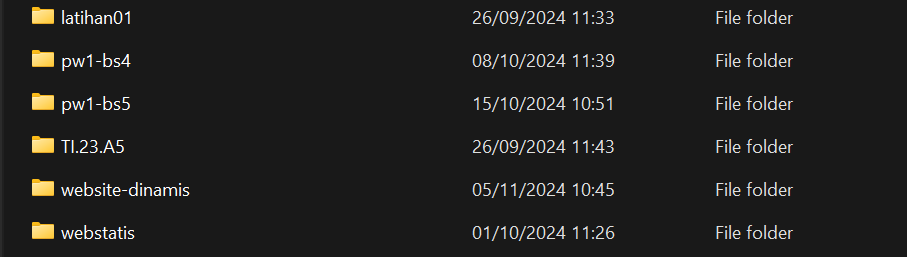
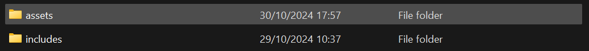
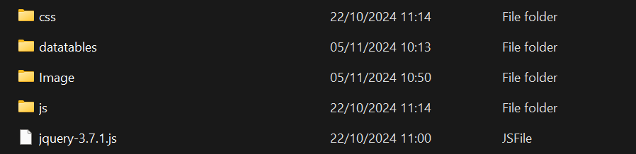

## 2. Menjalankan Apache Server

Menjalankan Apache dari XAMPP **XAMPP Control.**

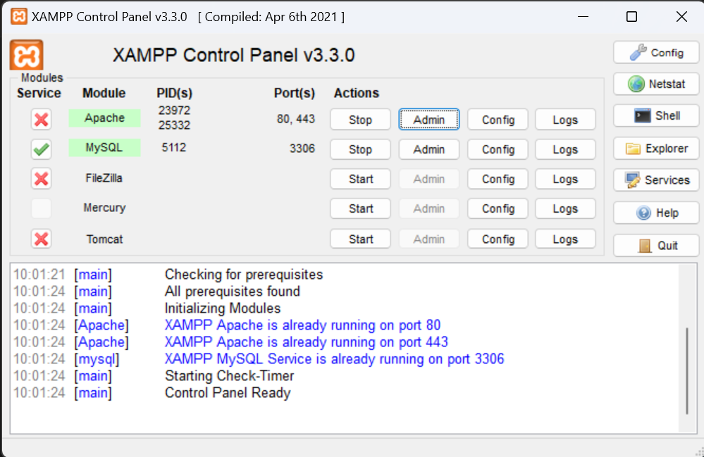

### Mengakses Apache Client menggunakan 'website-dinamis'.

Pastikan webserver Apache sudah dijalankan. Kemudian untuk mengakses directory tersebut pada web server dengan mengakses URL : http://localhost/website-dinamis

## 3. Membuat index : membuat website-dinamis

### Membuat tampilan didalam  index.php


```
<!doctype html>
<html lang="en">

<head>
    <meta charset="utf-8">
    <meta name="viewport" content="width=device-width, initial-scale=1">
    <title>Bootstrap demo</title>
    <!-- CSS Bootstrap -->
    <link href="assets/css/bootstrap.min.css" rel="stylesheet">

    <!-- CSS Datatables -->
    <link href="assets/datatables/dataTables.bootstrap5.css" rel="stylesheet">
</head>

<body>
    <header>
        <h1 class="text-center p-3">Membuat website dinamis</h1>
    </header>
    <!-- navbar -->
    <?php include "includes/navbar.php" ?>
    <!-- ./navbar -->

    <!-- konten -->
    <div class="container mt-3">
        <?php include "konten.php" ?>
    </div>
    <!-- konten -->

    <footer>
        <div class="text-bg-dark p-3 text-center">
            Pemrograman Web Muhammad Nurul Firdaus <?= date(format: "Y") ?>
        </div>
    </footer>

    </div>
    <script src="assets/jquery-3.7.1.js"></script>
    <script src="assets/js/bootstrap.bundle.min.js"></script>
    <script src="assets/datatables/dataTables.js"></script>
    <script src="assets/datatables/dataTables.bootstrap5.js"></script>

    <script>
    new DataTable('#example');
    </script>
</body>

</html>
```

### Menambahkan Data navbar

```
<nav class="navbar bg-dark navbar-expand-md bg-body-tertiary" data-bs- theme="dark">
    <div class="container-fluid">
        <a class="navbar-brand" href="?page=home">Yunn</a>
        <button class="navbar-toggler" type="button" data-bs-toggle="collapse" data-bs-target="#navbarSupportedContent"
            aria-controls="navbarSupportedContent" aria-expanded="false" aria- label="Toggle navigation">

            <span class="navbar-toggler-icon"></span>
        </button>
        <div class="collapse navbar-collapse" id="navbarSupportedContent">
            <ul class="navbar-nav me-auto mb-2 mb-lg-0">
                <li class="nav-item">
                    <a class="nav-link active" aria-current="page" href="?page=home">Home</a>
                </li>
                <li class="nav-item">
                    <a class="nav-link" href="?page=about">About</a>
                </li>
                <li class="nav-item">
                    <a class="nav-link" href="?page=contact">Contact</a>
                </li>

                <li class="nav-item dropdown">
                    <a class="nav-link dropdown-toggle" href="#" role="button" data-bs-toggle="dropdown"
                        aria-expanded="false">
                        Belajar
                    </a>
                    <ul class="dropdown-menu">
                        <li><a class="dropdown-item" href="?page=datatables">Datatables</a></li>

                        <li><a class="dropdown-item" href="?page=form">Form</a></li>

                        <li>
                            <hr class="dropdown-divider">
                        </li>
                        <li><a class="dropdown-item" href="#">To Be Continued</a></li>

                    </ul>
                </li>
            </ul>
            <form class="d-flex" role="search">
                <input class="form-control me-2" type="search" placeholder="Search" aria-label="Search">

                <button class="btn btn-outline-success" type="submit">Search</button>

            </form>
        </div>
    </div>
</nav>
```

***Output Ketika Berhasil :***

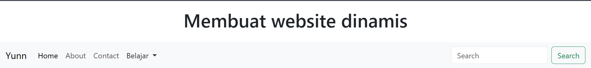

## 3. Menambahkan Home

dengan memasukan card dari https://getbootstrap.com/docs/5.3/components/card/

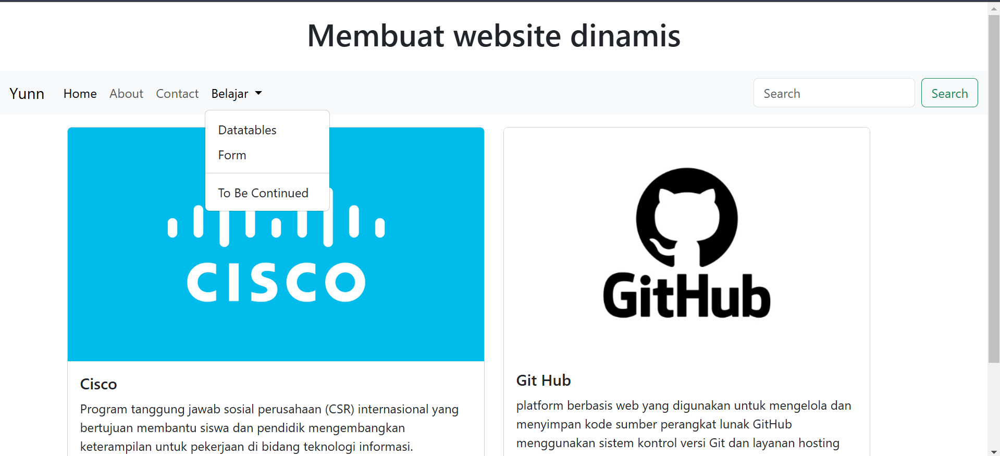
```
<div class="container">
    <div class="row">
        <!-- Card 1 -->
        <div class="col-md-6">
            <div class="card" style="width: 100%;">
                
                <div class="card-body">
                    <h5 class="card-title">Cisco</h5>
                    <p class="card-text">Program tanggung jawab sosial perusahaan (CSR) internasional yang bertujuan membantu siswa dan pendidik mengembangkan keterampilan untuk pekerjaan di bidang teknologi informasi.</p>
                    <a href="https://www.netacad.com/courses/networking-basics?courseLang=en-US" class="btn btn-primary">Go somewhere</a>
                </div>
            </div>
        </div>

        <!-- Card 2 -->
        <div class="col-md-6">
            <div class="card" style="width: 88%;">
                
                <div class="card-body">
                    <h5 class="card-title">Git Hub</h5>
                    <p class="card-text">platform berbasis web yang digunakan untuk mengelola dan menyimpan kode sumber perangkat lunak GitHub menggunakan sistem kontrol versi Git dan layanan hosting internet.</p>
                    <a href="https://github.com/nurulfir" class="btn btn-primary">Go somewhere</a>
                </div>
            </div>
        </div>
    </div>
</div>
```
## 4. Menambahkan About
dengan memasukan image dan carousel dari https://getbootstrap.com/docs/5.3/components/card/

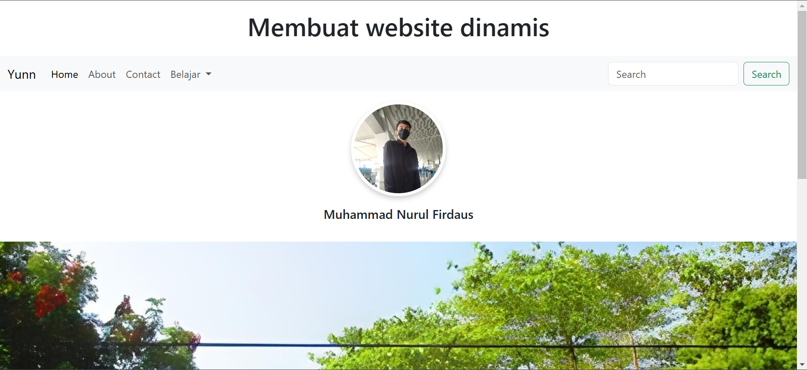

## 5. Menambahkan Contact
dengan memasukan halaman contact 

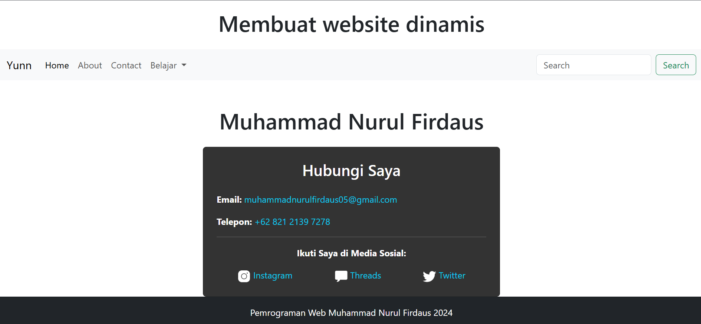
```
<!DOCTYPE html>
<html lang="en">
<head>
  <meta charset="UTF-8">
  <meta name="viewport" content="width=device-width, initial-scale=1.0">
  <title>Contact</title>
  <link rel="stylesheet" href="assets/css/bootstrap.min.css">
  <style>
    .card {
      background-color: #333; 
      color: #fff;
    }

    .card a {
      color: #0dcaf0;
      text-decoration: none;
    }

    .card a:hover {
      color: #fff;
    }

    .card img {
      filter: brightness(0) invert(1);
    }
  </style>
</head>
<body>

<div class="container mt-5">
  <h1 class="text-center">Muhammad Nurul Firdaus</h1>
  <div class="row justify-content-center mt-4">
    <div class="col-md-6">
      <div class="card p-4">
        <h3 class="text-center">Hubungi Saya</h3>
        <div class="contact-info mt-3">
          <p><strong>Email:</strong> <a href="mailto:muhammadnurulfirdaus05@gmail.com">muhammadnurulfirdaus05@gmail.com</a></p>
          <p><strong>Telepon:</strong> <a href="tel:+6282121397278">+62 821 2139 7278</a></p>
          <hr>
          <p class="text-center"><strong>Ikuti Saya di Media Sosial:</strong></p>
          <div class="d-flex justify-content-around">
            <a href="https://instagram.com/mhmmdnrlfirdaus" target="_blank">
               Instagram
            </a>
            <a href="https://threads.net/mhmmdnrlfirdaus" target="_blank">
               Threads
            </a>
            <a href="https://twitter.com/YunnRuncandel" target="_blank">
               Twitter
            </a>
          </div>
        </div>
      </div>
    </div>
  </div>
</div>

<script src="assets/js/bootstrap.bundle.min.js"></script>
</body>
</html>
```
## Membuat Datatables di belajar
memberikan script untuk datatables.php yang mengacu pada: https://datatables.net/examples/styling/bootstrap5.html

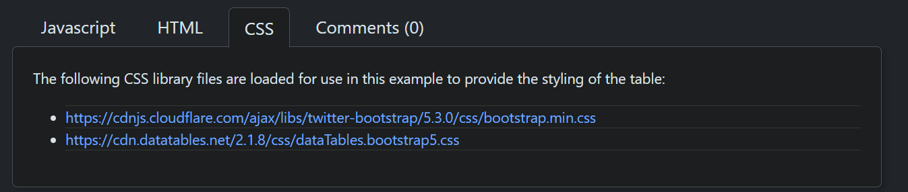
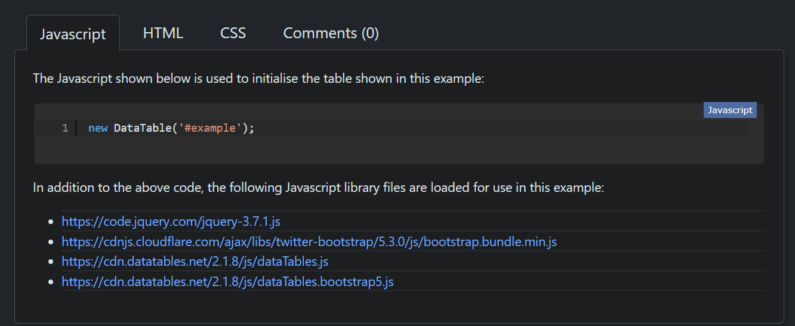
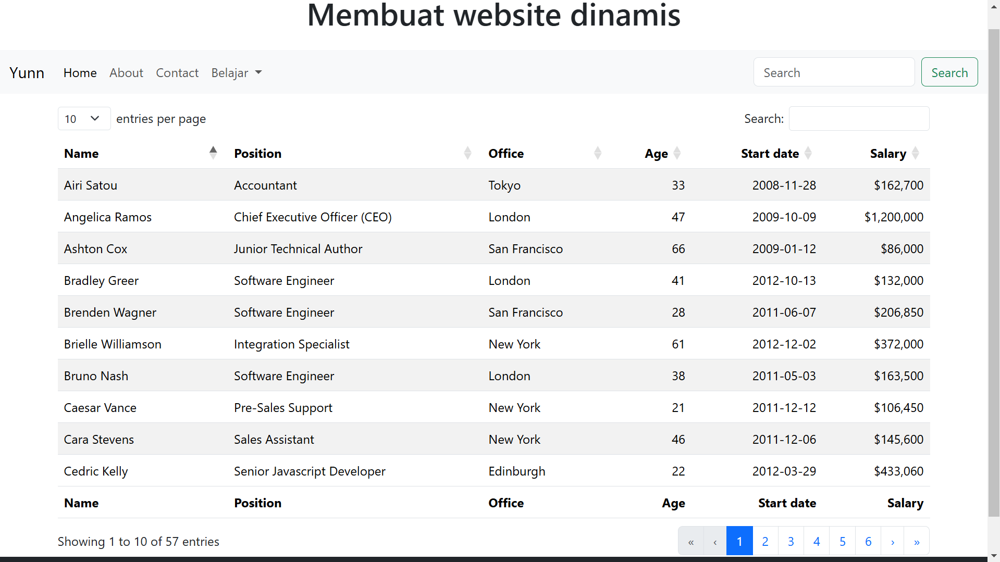

## Membuat form di belajar
dengan menambahkan form dari https://getbootstrap.com/docs/5.3/forms/overview/#overview

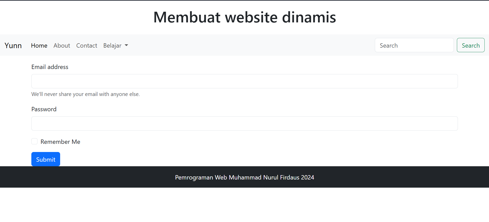

## SELESAI  